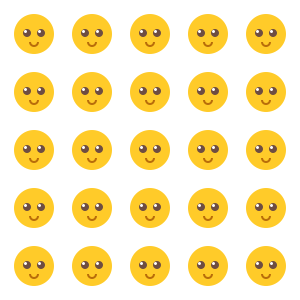

# Übung Zeichnungsobjekte 1

Erstellen Sie ein Programm, in welchem auf einem Screen mit den Abmessungen 300 x 300 Pixel symmetrisch verteilt
25 Smileys gezeichnet werden.  
Als Basisbild können Sie die Datei `img/smiley_48_48.png` verwenden. 

    Benutzen Sie eine doppelte for-Schleife.

